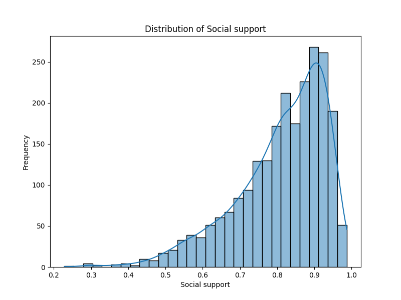

# Analysis Report for happiness.csv

## Dataset Overview

Shape: (2363, 11)

Columns: Country name, year, Life Ladder, Log GDP per capita, Social support, Healthy life expectancy at birth, Freedom to make life choices, Generosity, Perceptions of corruption, Positive affect, Negative affect

       Country name         year  Life Ladder  Log GDP per capita  ...   Generosity  Perceptions of corruption  Positive affect  Negative affect
count          2363  2363.000000  2363.000000         2335.000000  ...  2282.000000                2238.000000      2339.000000      2347.000000
unique          165          NaN          NaN                 NaN  ...          NaN                        NaN              NaN              NaN
top       Argentina          NaN          NaN                 NaN  ...          NaN                        NaN              NaN              NaN
freq             18          NaN          NaN                 NaN  ...          NaN                        NaN              NaN              NaN
mean            NaN  2014.763860     5.483566            9.399671  ...     0.000098                   0.743971         0.651882         0.273151
std             NaN     5.059436     1.125522            1.152069  ...     0.161388                   0.184865         0.106240         0.087131
min             NaN  2005.000000     1.281000            5.527000  ...    -0.340000                   0.035000         0.179000         0.083000
25%             NaN  2011.000000     4.647000            8.506500  ...    -0.112000                   0.687000         0.572000         0.209000
50%             NaN  2015.000000     5.449000            9.503000  ...    -0.022000                   0.798500         0.663000         0.262000
75%             NaN  2019.000000     6.323500           10.392500  ...     0.093750                   0.867750         0.737000         0.326000
max             NaN  2023.000000     8.019000           11.676000  ...     0.700000                   0.983000         0.884000         0.705000

[11 rows x 11 columns]

## Null Value Analysis

Country name                          0
year                                  0
Life Ladder                           0
Log GDP per capita                   28
Social support                       13
Healthy life expectancy at birth     63
Freedom to make life choices         36
Generosity                           81
Perceptions of corruption           125
Positive affect                      24
Negative affect                      16
dtype: int64

## Key Insights

Highly correlated columns: Log GDP per capita                Healthy life expectancy at birth    0.819326
Life Ladder                       Log GDP per capita                  0.783556
Social support                    Life Ladder                         0.722738
Healthy life expectancy at birth  Life Ladder                         0.714927
dtype: float64

Most common value in Country name: Argentina

## Charts

![Correlation Heatmap][def]

![year Distribution][def2]

![Generosity Distribution][def3]

[def]: correlation_heatmap.png
[def2]: year_distribution.png
[def3]: Generosity_distribution.png